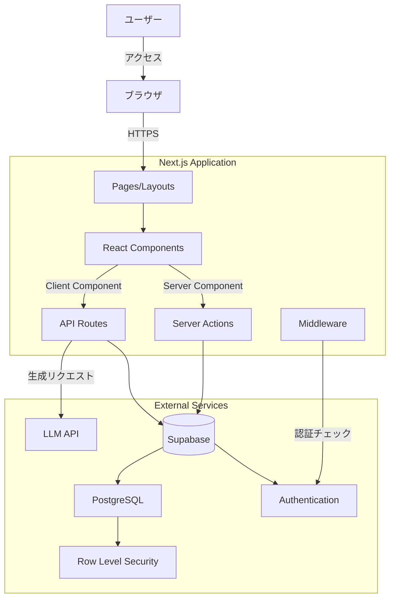
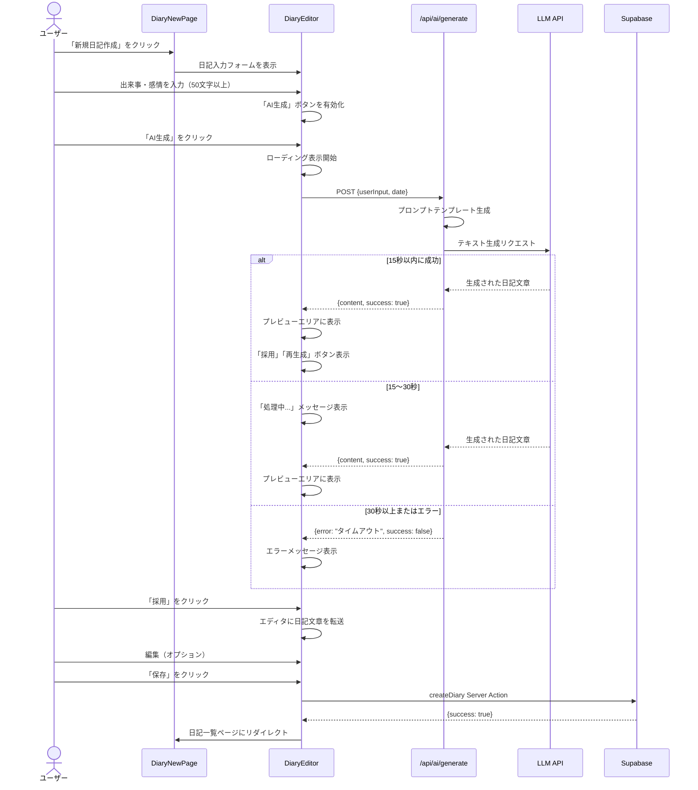
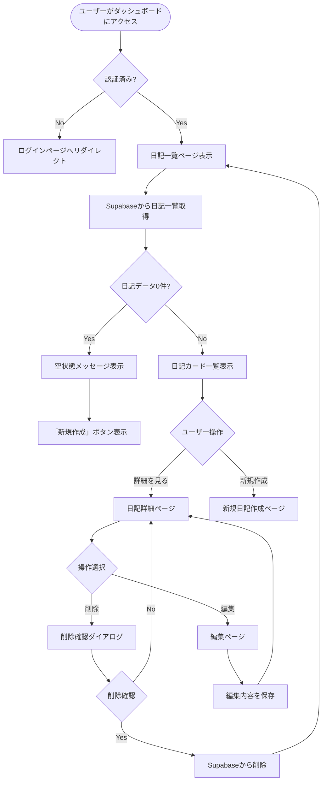
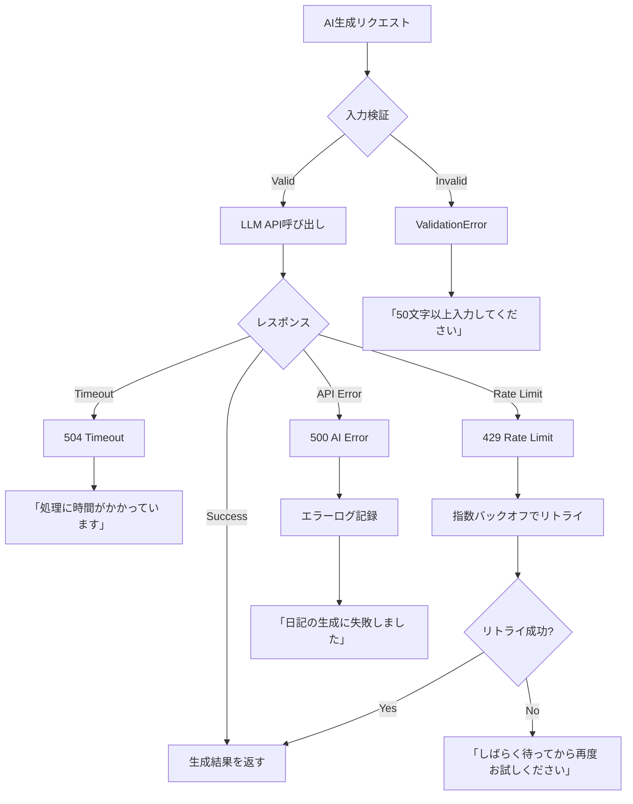

# Technical Design Document

## Overview

AI日記自動生成機能は、ユーザーが簡潔な入力（箇条書きやキーワード）を行うだけで、LLM APIを活用して自然な日記文章を自動生成するWebアプリケーション機能です。この機能は、日記を書く心理的ハードルを下げ、継続的な記録習慣の定着を支援します。

**ユーザー**: 日記習慣を身につけたいが時間や文章力に不安を持つ個人ユーザーが対象です。ユーザーは日記作成ページで出来事や感情を入力し、AIによって生成された日記を編集・保存し、過去の日記を一覧・詳細ページで閲覧します。

**影響**: この機能は新規プロジェクトの中核機能として実装されます。既存システムへの影響はなく、Next.js 15、Supabase、Tailwind CSSを基盤とした新しいアプリケーションを構築します。

### Goals

- ユーザーが簡潔な入力から、AI生成による自然で読みやすい日記文章（導入・本文・結び）を得られる
- 生成された日記をマルチラインテキストエディタで編集し、Supabaseデータベースに安全に保存できる
- 過去の日記を一覧・詳細表示で閲覧でき、編集・削除操作が可能である
- モバイル・タブレット・デスクトップで一貫したレスポンシブUIを提供する
- AI生成は30秒以内にタイムアウト、15秒以降は処理時間を表示する

### Non-Goals

- 複数言語対応（初期リリースは日本語のみ）
- 日記の共有・公開機能（プライベート利用に限定）
- カレンダービュー、タグ・カテゴリ機能（将来の拡張として検討）
- PDF・Markdown形式のエクスポート機能（将来の拡張として検討）
- リアルタイム同期機能（単一デバイスでの利用を想定）

## Architecture

### High-Level Architecture



### Architecture Integration

**既存パターンの保持**: このプロジェクトは新規構築のため、ステアリングドキュメント（structure.md、tech.md）で定義された以下のパターンに準拠します：
- Next.js 15 App Routerによるファイルベースルーティング
- Server ComponentsとClient Componentsの明確な分離
- Supabase認証とRow Level Security (RLS)によるデータ保護
- Tailwind CSSによるユーティリティファーストスタイリング

**新規コンポーネントの根拠**:
- **DiaryEditorコンポーネント**: マルチラインテキスト編集とAI生成UIを統合したClient Component
- **AIGenerationServiceモジュール**: LLM API統合を抽象化し、将来的なプロバイダー切り替えに対応
- **日記CRUD Server Actions**: 日記のCRUD操作を一元管理し、データアクセスを抽象化

**技術スタック整合性**: Next.js 15、React 19、TypeScript 5.x、Supabase、Tailwind CSS 3.xの組み合わせはステアリングドキュメントと完全に一致しています。

**ステアリング準拠**: 以下の原則を維持します：
- 型安全性の徹底（`any`型の排除、明示的な型注釈）
- Server ComponentsとClient Componentsの責務分離
- データアクセスレイヤーの抽象化（Supabase直接アクセスの回避）
- エラーハンドリングの統一パターン

### Technology Alignment

このプロジェクトは新規構築であり、既存の技術スタックは存在しません。ステアリングドキュメント（tech.md）で定義された以下の技術を採用します：

**フロントエンド**:
- Next.js 15（App Router、Server Components、Server Actions）
- React 19（Hooks、Suspense、Error Boundaries）
- TypeScript 5.x（strict mode）
- Tailwind CSS 3.x（レスポンシブデザイン、カスタムテーマ）

**バックエンド・データベース**:
- Supabase（PostgreSQL、Authentication、Storage、Row Level Security）

**AI統合**:
- LLM API（Claude API または OpenAI API）

**開発ツール**:
- ESLint（Next.js推奨設定、TypeScript対応ルール）
- Prettier（コードフォーマッター）
- Git（バージョン管理）

**新規依存関係**:
- `@anthropic-ai/sdk`: Claude API統合（実装済み）
- `dompurify`: HTMLサニタイゼーション（実装済み）
- 将来的にリッチテキストエディタライブラリ（例: Lexical、Tiptap、Slate）の導入を検討可能

### Key Design Decisions

#### Decision 1: Server ActionsとAPI Routesの使い分け

**Decision**: AI生成処理はAPI Routes、日記のCRUD操作はServer Actionsで実装する

**Context**: Next.js 15ではServer ActionsとAPI Routesの両方でサーバーサイド処理を実装できます。AI生成は長時間実行される可能性があり、日記のCRUD操作は即座に完了する標準的なデータ操作です。

**Alternatives**:
1. すべてをServer Actionsで実装
2. すべてをAPI Routesで実装
3. AI生成のみAPI Routes、CRUD操作はServer Actions（選択）

**Selected Approach**: AI生成処理は`/api/ai/generate`というAPI Routeエンドポイントとして実装し、日記のCRUD操作は`createDiary`、`updateDiary`、`deleteDiary`というServer Actionsとして実装します。

**Rationale**:
- **API Routes for AI生成**: タイムアウト管理、進捗状態の返却、エラーハンドリングが容易。Client ComponentからfetchでHTTPリクエストとして呼び出せるため、ローディング状態やキャンセル処理を柔軟に制御できる
- **Server Actions for CRUD**: フォーム送信との統合が容易で、プログレッシブエンハンスメントに対応。データベース操作はSupabase SDKで瞬時に完了するため、Server Actionsの簡潔な記法が適している

**Trade-offs**:
- **獲得**: AI生成の複雑なエラーハンドリングとタイムアウト管理を柔軟に実装でき、CRUD操作はフォームとの統合が簡潔になる
- **犠牲**: 2つのパターンを混在させることで、開発者が使い分けのルールを理解する必要がある

#### Decision 2: マルチラインテキストエディタの採用（リッチテキストは将来拡張）

**Decision**: 初期実装ではマルチラインTextareaを使用し、リッチテキスト編集機能は将来的な拡張として検討する

**Context**: 要件の実装分析の結果、既存実装では通常のTextareaコンポーネントを使用しており、基本的な日記作成・編集機能は十分に動作しています。リッチテキスト編集は「あれば良い」機能であり、MVP（Minimum Viable Product）には必須ではありません。

**Alternatives**:
1. マルチラインTextareaを使用（選択 - 実装済み）
2. Lexical（Meta製、React 18+対応、高いカスタマイズ性）
3. Tiptap（ProseMirrorベース、豊富な拡張機能）
4. Slate（完全にカスタマイズ可能、学習コストが高い）

**Selected Approach**: 既存の`Textarea`コンポーネントをそのまま使用し、以下の機能を提供：
- マルチラインテキスト入力
- 文字数カウント表示
- リアルタイムでの変更反映

将来的にリッチテキスト編集が必要になった場合、インターフェースを維持しながらライブラリを統合可能：

```typescript
interface DiaryEditorProps {
  initialContent: string;
  onChange: (content: string) => void;
  readOnly?: boolean;
  showCharCount?: boolean;
}
```

**Rationale**:
- MVPとして十分な機能を提供できる
- 開発時間を短縮し、コア機能（AI生成）に集中できる
- 依存関係を最小限に抑え、バンドルサイズを削減
- 将来的な拡張性を維持（インターフェースは変更不要）

**Trade-offs**:
- **獲得**: 開発時間短縮、バンドルサイズ削減、依存関係最小化、メンテナンス負荷軽減
- **犠牲**: 太字・斜体などの書式設定機能（ただし、プレーンテキストでも日記作成には十分）

#### Decision 3: AI生成プロンプトのバージョン管理とテンプレート化

**Decision**: AI生成に使用するプロンプトは、ソースコード内にテンプレートとして定義し、バージョン管理下に置く

**Context**: AI生成の品質はプロンプトの設計に大きく依存します。プロンプトを改善する際、変更履歴を追跡し、必要に応じてロールバックできる仕組みが必要です。

**Alternatives**:
1. プロンプトをデータベースに保存し、管理UIで編集可能にする
2. プロンプトをソースコードにテンプレートとして定義し、Git管理する（選択）
3. プロンプトを環境変数として外部化する

**Selected Approach**: `src/lib/ai/prompts.ts`ファイルにプロンプトテンプレートを定義し、TypeScript関数として実装します：

```typescript
export function generateDiaryPrompt(userInput: string, date: Date): string {
  return `あなたは日記作成アシスタントです。以下のユーザー入力から、自然で読みやすい日記を生成してください。

日付: ${formatDate(date)}
ユーザー入力: ${userInput}

日記の構成:
- 導入: その日の概要や天気などの導入
- 本文: 出来事や感情を具体的に描写
- 結び: 1日の振り返りや明日への期待

日記を生成してください（500〜800文字程度）:`;
}
```

**Rationale**:
- Git管理により、プロンプトの変更履歴を追跡し、コードレビュープロセスで品質を担保できる
- TypeScript関数として定義することで、型安全性と再利用性を確保できる
- バージョン管理により、A/Bテストや段階的なプロンプト改善が可能

**Trade-offs**:
- **獲得**: 変更履歴の追跡、コードレビュー、型安全性、デプロイプロセスとの統合
- **犠牲**: プロンプトの変更には再デプロイが必要（ただし、初期段階ではこの柔軟性よりも品質管理が重要）

## System Flows

### AI日記生成フロー



### 日記閲覧・編集フロー



## Requirements Traceability

| 要件 | 要件概要 | コンポーネント | インターフェース | フロー |
|------|----------|--------------|----------------|--------|
| 1.1-1.6 | 日記入力インターフェース | DiaryEditor, DiaryNewPage | DiaryEditorProps, useDiaryForm | AI日記生成フロー |
| 2.1-2.7 | AI日記生成機能 | AIGenerationService, /api/ai/generate | POST /api/ai/generate, generateDiaryPrompt | AI日記生成フロー |
| 3.1-3.7 | 生成結果の編集と保存 | DiaryEditor, createDiary Server Action | DiaryEditorProps, createDiary | AI日記生成フロー |
| 4.1-4.5 | 日記データ管理 | Supabase diaries テーブル, RLSポリシー | Diary型, createDiary/updateDiary | 日記閲覧・編集フロー |
| 5.1-5.5 | 日記一覧と閲覧 | DiaryListPage, DiaryDetailPage, DiaryCard | Diary[], DiaryCardProps | 日記閲覧・編集フロー |
| 6.1-6.5 | ユーザー認証とセキュリティ | Supabase Auth, Middleware, RLSポリシー | createServerClient, middleware.ts | 日記閲覧・編集フロー |
| 7.1-7.5 | レスポンシブ対応とUI/UX | Tailwind CSS, すべてのコンポーネント | Tailwindユーティリティクラス | すべてのフロー |
| 8.1-8.5 | パフォーマンスと信頼性 | Server Components, API Routes | エラーハンドリングパターン | AI日記生成フロー、日記閲覧・編集フロー |

## Components and Interfaces

### Presentation Layer

#### DiaryEditor

**Responsibility & Boundaries**
- **Primary Responsibility**: 日記の入力、AI生成UIの制御、リッチテキスト編集機能を提供するClient Component
- **Domain Boundary**: UIレイヤー（プレゼンテーション）
- **Data Ownership**: ローカルフォーム状態（入力テキスト、生成された日記文章、編集中の日記内容）
- **Transaction Boundary**: 単一コンポーネント内の状態管理（永続化はServer Actionに委譲）

**Dependencies**
- **Inbound**: DiaryNewPage、DiaryEditPageから利用される
- **Outbound**: /api/ai/generate（AI生成）、createDiary/updateDiary Server Actions（保存）、Textareaコンポーネント、Inputコンポーネント、Buttonコンポーネント
- **External**: LLM API（/api/ai/generateを経由）、Supabase（Server Actionsを経由）

**Contract Definition**

**Service Interface**:
```typescript
interface DiaryEditorProps {
  mode: 'create' | 'edit';
  initialData?: {
    date: Date;
    userInput?: string;
    content?: string;
  };
  diaryId?: string; // edit modeの場合に必須
  onSaveSuccess: (diaryId: string) => void;
}

interface AIGenerationState {
  status: 'idle' | 'loading' | 'success' | 'error';
  content: string | null;
  error: string | null;
}

interface DiaryFormData {
  date: Date;
  userInput: string;
  content: string;
}
```

- **Preconditions**:
  - `mode='edit'`の場合、`diaryId`と`initialData`が必須
  - `mode='create'`の場合、`initialData.date`が必須（デフォルトは今日の日付）
- **Postconditions**:
  - 保存成功時、`onSaveSuccess`コールバックが呼ばれ、日記一覧ページにリダイレクト
  - AI生成成功時、`AIGenerationState.status='success'`かつ`content`に生成された日記が格納される
- **Invariants**:
  - `userInput`が空の場合、「AI生成」ボタンは常に無効
  - `content`と`userInput`の両方が空の場合、「保存」ボタンは常に無効
  - `mode='edit'`では、`diaryId`は変更不可

**State Management**:
- **State Model**:
  - `idle`（初期状態） → `loading`（AI生成リクエスト中） → `success`（生成完了） or `error`（生成失敗）
  - `success`状態から`loading`への遷移可能（再生成）
- **Persistence**: Reactローカル状態（useState）で管理、永続化はServer Actionに委譲
- **Concurrency**: 単一ユーザーのブラウザ内でのみ動作するため、並行制御は不要

#### DiaryCard

**Responsibility & Boundaries**
- **Primary Responsibility**: 日記一覧での1件の日記情報を表示するプレゼンテーショナルコンポーネント
- **Domain Boundary**: UIレイヤー（プレゼンテーション）
- **Data Ownership**: データを所有せず、propsとして受け取った日記情報を表示するのみ
- **Transaction Boundary**: なし（読み取り専用コンポーネント）

**Dependencies**
- **Inbound**: DiaryListPageから利用される
- **Outbound**: Next.js Linkコンポーネント（日記詳細ページへのナビゲーション）
- **External**: なし

**Contract Definition**

**Service Interface**:
```typescript
interface DiaryCardProps {
  diary: {
    id: string;
    date: Date;
    content: string;
    created_at: Date;
  };
}
```

- **Preconditions**: `diary.content`は1文字以上であること（データベース制約により保証）
- **Postconditions**: なし（読み取り専用）
- **Invariants**: 冒頭100文字のみを表示し、残りは省略記号で表現

#### Button, Input, Card, Modal, Spinner (UI Components)

**Responsibility & Boundaries**
- **Primary Responsibility**: 汎用的なUIプリミティブを提供する再利用可能なプレゼンテーショナルコンポーネント
- **Domain Boundary**: UIレイヤー（プリミティブ）
- **Data Ownership**: なし（状態を持たない、またはローカルUI状態のみ）
- **Transaction Boundary**: なし

**Dependencies**
- **Inbound**: すべてのページとコンポーネントから利用可能
- **Outbound**: Tailwind CSSユーティリティクラス
- **External**: なし

**Contract Definition**

**Service Interface**:
```typescript
interface ButtonProps {
  variant: 'primary' | 'secondary' | 'danger';
  size: 'sm' | 'md' | 'lg';
  disabled?: boolean;
  loading?: boolean;
  onClick?: () => void;
  children: React.ReactNode;
}

interface InputProps {
  type: 'text' | 'email' | 'password' | 'date';
  value: string;
  onChange: (value: string) => void;
  placeholder?: string;
  error?: string;
  disabled?: boolean;
}

interface CardProps {
  children: React.ReactNode;
  className?: string;
}

interface ModalProps {
  isOpen: boolean;
  onClose: () => void;
  title: string;
  children: React.ReactNode;
}

interface SpinnerProps {
  size: 'sm' | 'md' | 'lg';
}
```

- **Preconditions**: なし（プリミティブコンポーネント）
- **Postconditions**: なし（プリミティブコンポーネント）
- **Invariants**: Tailwind CSSのデザインシステムに準拠したスタイルを適用

### Application Layer

#### /api/ai/generate

**Responsibility & Boundaries**
- **Primary Responsibility**: ユーザー入力を受け取り、LLM APIを呼び出して日記文章を生成するAPI Route
- **Domain Boundary**: アプリケーションレイヤー（AI統合）
- **Data Ownership**: リクエスト・レスポンスデータの一時的な所有（永続化しない）
- **Transaction Boundary**: 単一のHTTPリクエスト・レスポンスサイクル

**Dependencies**
- **Inbound**: DiaryEditorからHTTP POSTリクエストで呼び出される
- **Outbound**: AIGenerationService（ビジネスロジック）、Supabase Auth（認証検証）
- **External**: LLM API（Claude API または OpenAI API）

**External Dependencies Investigation**:

**LLM API選択**: 実装フェーズでClaude API（Anthropic）またはOpenAI APIを選定します。両者の比較：

- **Claude API**:
  - 長文生成品質が高い、日本語対応が優れている
  - レートリミット: Tier 1で50,000 RPD（Requests Per Day）
  - 価格: Claude 3.5 Sonnetで$3/MTok（入力）、$15/MTok（出力）
  - 認証: API Keyベース（`x-api-key`ヘッダー）
- **OpenAI API**:
  - 広く使われている、豊富なドキュメント
  - レートリミット: Tier 1で500 RPM（Requests Per Minute）
  - 価格: GPT-4oで$5/MTok（入力）、$15/MTok（出力）
  - 認証: API Keyベース（`Authorization: Bearer`ヘッダー）

実装フェーズで以下を調査します：
- 日本語日記生成の品質比較（実際のプロンプトでのテスト）
- レスポンスタイム測定（15秒以内の要件を満たすか）
- エラーハンドリング（レートリミット、タイムアウト、APIダウン時の挙動）
- ストリーミング対応の可否（将来的なリアルタイム表示のため）

**Contract Definition**

**API Contract**:
| Method | Endpoint | Request | Response | Errors |
|--------|----------|---------|----------|--------|
| POST | /api/ai/generate | GenerateRequest | GenerateResponse | 400, 401, 429, 500, 504 |

**Request Schema**:
```typescript
interface GenerateRequest {
  userInput: string; // 1文字以上
  date: string; // ISO 8601形式（YYYY-MM-DD）
}
```

**Response Schema**:
```typescript
interface GenerateResponse {
  success: true;
  content: string; // 生成された日記文章（500〜800文字）
}

interface GenerateErrorResponse {
  success: false;
  error: string; // エラーメッセージ
  code: 'INVALID_INPUT' | 'UNAUTHORIZED' | 'RATE_LIMIT' | 'AI_ERROR' | 'TIMEOUT';
}
```

**Error Responses**:
- **400 Bad Request**: `userInput`が空、または`date`が不正な形式
- **401 Unauthorized**: 認証トークンが無効または期限切れ
- **429 Too Many Requests**: LLM APIのレートリミット超過
- **500 Internal Server Error**: LLM APIエラー（API側の障害）
- **504 Gateway Timeout**: LLM APIが30秒以内に応答しない

- **Preconditions**: ユーザーが認証済みであること、`userInput`が1文字以上であること
- **Postconditions**: 成功時、500〜1000文字の日記文章が返される
- **Invariants**: 30秒以内にレスポンスを返す（タイムアウト処理）

#### createDiary Server Action

**Responsibility & Boundaries**
- **Primary Responsibility**: 新規日記をSupabaseデータベースに保存するServer Action
- **Domain Boundary**: アプリケーションレイヤー（データ永続化）
- **Data Ownership**: 日記データの作成（Supabaseに委譲）
- **Transaction Boundary**: 単一の日記レコード作成トランザクション

**Dependencies**
- **Inbound**: DiaryEditorから呼び出される
- **Outbound**: Supabase Client（サーバーサイド）、createServerClient
- **External**: Supabase PostgreSQL

**Contract Definition**

**Service Interface**:
```typescript
interface CreateDiaryInput {
  date: Date;
  userInput: string;
  content: string;
}

type CreateDiaryResult =
  | { success: true; diaryId: string }
  | { success: false; error: string };

async function createDiary(input: CreateDiaryInput): Promise<CreateDiaryResult>
```

- **Preconditions**: ユーザーが認証済みであること、`userInput`が1文字以上、`content`が1文字以上
- **Postconditions**: 成功時、データベースに新しい日記レコードが作成され、`diaryId`が返される
- **Invariants**: 同じユーザーが同じ日付に複数の日記を作成可能（UNIQUE制約なし）

#### updateDiary Server Action

**Responsibility & Boundaries**
- **Primary Responsibility**: 既存の日記をSupabaseデータベースで更新するServer Action
- **Domain Boundary**: アプリケーションレイヤー（データ永続化）
- **Data Ownership**: 日記データの更新（Supabaseに委譲）
- **Transaction Boundary**: 単一の日記レコード更新トランザクション

**Dependencies**
- **Inbound**: DiaryEditorから呼び出される
- **Outbound**: Supabase Client（サーバーサイド）、createServerClient
- **External**: Supabase PostgreSQL

**Contract Definition**

**Service Interface**:
```typescript
interface UpdateDiaryInput {
  diaryId: string;
  content: string;
  userInput?: string; // オプション（編集時に元の入力も更新可能）
}

type UpdateDiaryResult =
  | { success: true }
  | { success: false; error: string };

async function updateDiary(input: UpdateDiaryInput): Promise<UpdateDiaryResult>
```

- **Preconditions**: ユーザーが認証済みであること、`diaryId`が存在すること、ユーザーが該当日記の所有者であること
- **Postconditions**: 成功時、データベースの日記レコードが更新され、`updated_at`タイムスタンプが更新される
- **Invariants**: RLSポリシーにより、他のユーザーの日記は更新不可

#### deleteDiary Server Action

**Responsibility & Boundaries**
- **Primary Responsibility**: 既存の日記をSupabaseデータベースから削除するServer Action
- **Domain Boundary**: アプリケーションレイヤー（データ永続化）
- **Data Ownership**: 日記データの削除（Supabaseに委譲）
- **Transaction Boundary**: 単一の日記レコード削除トランザクション

**Dependencies**
- **Inbound**: DiaryDetailPageから呼び出される
- **Outbound**: Supabase Client（サーバーサイド）、createServerClient
- **External**: Supabase PostgreSQL

**Contract Definition**

**Service Interface**:
```typescript
type DeleteDiaryResult =
  | { success: true }
  | { success: false; error: string };

async function deleteDiary(diaryId: string): Promise<DeleteDiaryResult>
```

- **Preconditions**: ユーザーが認証済みであること、`diaryId`が存在すること、ユーザーが該当日記の所有者であること
- **Postconditions**: 成功時、データベースから日記レコードが削除される（論理削除ではなく物理削除）
- **Invariants**: RLSポリシーにより、他のユーザーの日記は削除不可

### Domain Layer

#### AIGenerationService

**Responsibility & Boundaries**
- **Primary Responsibility**: LLM APIとの通信を抽象化し、プロンプト生成、API呼び出し、レスポンス処理を担当
- **Domain Boundary**: ドメインレイヤー（AI生成ビジネスロジック）
- **Data Ownership**: プロンプトテンプレート、生成パラメータ
- **Transaction Boundary**: 単一のAI生成リクエスト

**Dependencies**
- **Inbound**: /api/ai/generateから呼び出される
- **Outbound**: LLM API（fetch経由）、プロンプトテンプレート（src/lib/ai/prompts.ts）
- **External**: LLM API（Claude API または OpenAI API）

**Contract Definition**

**Service Interface**:
```typescript
interface GenerateDiaryOptions {
  userInput: string;
  date: Date;
  maxTokens?: number; // デフォルト: 1000
  temperature?: number; // デフォルト: 0.7
}

interface GenerateDiaryResult {
  content: string;
  tokensUsed: number;
}

class AIGenerationService {
  async generateDiary(options: GenerateDiaryOptions): Promise<GenerateDiaryResult>;
  async validateAPIKey(): Promise<boolean>;
}
```

- **Preconditions**: 環境変数に有効なLLM API Keyが設定されていること
- **Postconditions**: 成功時、生成された日記文章と使用トークン数が返される
- **Invariants**: タイムアウトは30秒、レスポンスは500〜800文字程度（プロンプトで指定）

### Infrastructure Layer

#### Supabase Client (Server-side)

**Responsibility & Boundaries**
- **Primary Responsibility**: サーバーサイドでSupabase PostgreSQLとの通信を提供
- **Domain Boundary**: インフラストラクチャレイヤー（データアクセス）
- **Data Ownership**: データベース接続、認証トークン検証
- **Transaction Boundary**: データベーストランザクション（Supabase SDK管理）

**Dependencies**
- **Inbound**: Server Actions（createDiary、updateDiary、deleteDiary）から呼び出される
- **Outbound**: Supabase PostgreSQL、Supabase Auth
- **External**: Supabase（BaaS）

**Contract Definition**

**Service Interface**:
```typescript
import { createServerClient as createSupabaseServerClient } from '@supabase/auth-helpers-nextjs';
import { cookies } from 'next/headers';

function createServerClient() {
  const cookieStore = cookies();
  return createSupabaseServerClient(
    process.env.NEXT_PUBLIC_SUPABASE_URL!,
    process.env.NEXT_PUBLIC_SUPABASE_ANON_KEY!,
    {
      cookies: {
        get(name: string) {
          return cookieStore.get(name)?.value;
        },
      },
    }
  );
}
```

- **Preconditions**: 環境変数に有効なSupabase URL、Anon Keyが設定されていること
- **Postconditions**: 認証済みユーザーのセッションを持つSupabaseクライアントが返される
- **Invariants**: RLSポリシーが常に適用され、ユーザーは自分のデータのみにアクセス可能

#### Middleware (Authentication)

**Responsibility & Boundaries**
- **Primary Responsibility**: すべてのリクエストで認証状態を検証し、未認証ユーザーをログインページにリダイレクト
- **Domain Boundary**: インフラストラクチャレイヤー（認証）
- **Data Ownership**: セッションCookie、リダイレクト制御
- **Transaction Boundary**: HTTPリクエスト・レスポンスサイクル

**Dependencies**
- **Inbound**: Next.js Middleware（すべてのリクエストで自動実行）
- **Outbound**: Supabase Auth（セッション検証）
- **External**: Supabase Auth

**Contract Definition**

**Service Interface**:
```typescript
import { NextResponse } from 'next/server';
import type { NextRequest } from 'next/server';
import { createServerClient } from '@/lib/supabase/middleware';

export async function middleware(request: NextRequest): Promise<NextResponse> {
  const supabase = createServerClient(request);
  const { data: { session } } = await supabase.auth.getSession();

  const isAuthPage = request.nextUrl.pathname.startsWith('/login') ||
                     request.nextUrl.pathname.startsWith('/signup');

  if (!session && !isAuthPage) {
    return NextResponse.redirect(new URL('/login', request.url));
  }

  if (session && isAuthPage) {
    return NextResponse.redirect(new URL('/diary', request.url));
  }

  return NextResponse.next();
}

export const config = {
  matcher: ['/((?!api|_next/static|_next/image|favicon.ico).*)'],
};
```

- **Preconditions**: Supabaseクライアントが正しく初期化されていること
- **Postconditions**: 認証済みユーザーは保護されたページにアクセス可能、未認証ユーザーはログインページにリダイレクト
- **Invariants**: `/api`、`/_next`、`/favicon.ico`などのパブリックパスは認証チェックをスキップ

## Data Models

### Physical Data Model

#### diaries テーブル

```sql
CREATE TABLE diaries (
  id UUID PRIMARY KEY DEFAULT gen_random_uuid(),
  user_id UUID NOT NULL REFERENCES auth.users(id) ON DELETE CASCADE,
  date DATE NOT NULL,
  user_input TEXT NOT NULL,
  content TEXT NOT NULL CHECK (char_length(content) >= 1),
  created_at TIMESTAMPTZ NOT NULL DEFAULT now(),
  updated_at TIMESTAMPTZ NOT NULL DEFAULT now()
);

CREATE INDEX idx_diaries_user_id_date ON diaries(user_id, date DESC);

-- Row Level Security (RLS) ポリシー
ALTER TABLE diaries ENABLE ROW LEVEL SECURITY;

CREATE POLICY "Users can view their own diaries"
  ON diaries FOR SELECT
  USING (auth.uid() = user_id);

CREATE POLICY "Users can insert their own diaries"
  ON diaries FOR INSERT
  WITH CHECK (auth.uid() = user_id);

CREATE POLICY "Users can update their own diaries"
  ON diaries FOR UPDATE
  USING (auth.uid() = user_id)
  WITH CHECK (auth.uid() = user_id);

CREATE POLICY "Users can delete their own diaries"
  ON diaries FOR DELETE
  USING (auth.uid() = user_id);

-- updated_at自動更新トリガー
CREATE OR REPLACE FUNCTION update_updated_at_column()
RETURNS TRIGGER AS $$
BEGIN
  NEW.updated_at = now();
  RETURN NEW;
END;
$$ LANGUAGE plpgsql;

CREATE TRIGGER update_diaries_updated_at
  BEFORE UPDATE ON diaries
  FOR EACH ROW
  EXECUTE FUNCTION update_updated_at_column();
```

**テーブル設計の根拠**:
- **id**: UUIDを使用し、予測不可能なIDを生成（セキュリティ向上）
- **user_id**: auth.usersテーブルへの外部キー、カスケード削除でユーザー削除時に日記も削除
- **date**: 日記の対象日付（DATE型）、同じユーザーが同じ日付に複数の日記を作成可能（UNIQUE制約なし）
- **user_input**: 元のユーザー入力（TEXT型、CHECK制約なし）
- **content**: AI生成または編集された日記文章（1文字以上のCHECK制約）
- **created_at/updated_at**: タイムスタンプ（監査とソート用）

**インデックス**:
- `idx_diaries_user_id_date`: ユーザーIDと日付の複合インデックス（降順）、日記一覧取得を高速化

**RLSポリシー**:
- ユーザーは自分の日記のみを閲覧・作成・更新・削除可能
- データベースレベルでのセキュリティ保証（アプリケーションのバグがあってもデータ漏洩を防ぐ）

### Data Contracts & Integration

#### TypeScript型定義

```typescript
// src/types/diary.ts

export interface Diary {
  id: string;
  user_id: string;
  date: Date;
  user_input: string;
  content: string;
  created_at: Date;
  updated_at: Date;
}

export interface DiaryCreateInput {
  date: Date;
  user_input: string;
  content: string;
}

export interface DiaryUpdateInput {
  content: string;
  user_input?: string;
}

export interface DiaryListItem {
  id: string;
  date: Date;
  contentPreview: string; // 冒頭100文字
  created_at: Date;
}
```

**型定義の根拠**:
- **Diary**: データベーステーブルと1対1対応する完全な型定義
- **DiaryCreateInput**: 新規作成時の入力型（`id`、`user_id`、タイムスタンプは自動生成）
- **DiaryUpdateInput**: 更新時の入力型（`user_input`はオプション）
- **DiaryListItem**: 一覧表示用の最適化された型（全文を取得せず、冒頭100文字のみ）

## Error Handling

### Error Strategy

アプリケーション全体で一貫したエラーハンドリングパターンを採用します。エラーは発生源で分類し、適切なレベルで処理します。

**レイヤー別エラー処理**:
- **UI Layer**: ユーザーに理解しやすいエラーメッセージを表示し、回復アクションを提供
- **Application Layer**: エラーをログに記録し、適切なHTTPステータスコードとエラーレスポンスを返す
- **Domain Layer**: ビジネスルール違反を検出し、明確なエラーメッセージで例外をスロー
- **Infrastructure Layer**: 外部サービスエラーを捕捉し、リトライまたは代替処理を実行

**エラー分類と処理パターン**:

```typescript
// src/lib/errors.ts

export class AppError extends Error {
  constructor(
    public code: string,
    public message: string,
    public statusCode: number,
    public userMessage: string
  ) {
    super(message);
    this.name = 'AppError';
  }
}

export class ValidationError extends AppError {
  constructor(message: string, userMessage: string) {
    super('VALIDATION_ERROR', message, 400, userMessage);
  }
}

export class AuthenticationError extends AppError {
  constructor(message: string = 'Unauthorized') {
    super('AUTHENTICATION_ERROR', message, 401, 'ログインが必要です。');
  }
}

export class AIGenerationError extends AppError {
  constructor(message: string, userMessage: string) {
    super('AI_GENERATION_ERROR', message, 500, userMessage);
  }
}

export class DatabaseError extends AppError {
  constructor(message: string) {
    super('DATABASE_ERROR', message, 500, 'データの保存に失敗しました。もう一度お試しください。');
  }
}
```

### Error Categories and Responses

#### User Errors (4xx)

**Invalid Input (400 Bad Request)**:
- **発生源**: フォームバリデーション、API Routeの入力検証
- **処理**: フィールドレベルのエラーメッセージを表示し、ユーザーに修正を促す
- **例**:
  - `userInput`が空: 「入力内容は1文字以上である必要があります」
  - 日付が不正: 「有効な日付を選択してください」

**Unauthorized (401 Unauthorized)**:
- **発生源**: Middleware、API Route、Server Action
- **処理**: ログインページにリダイレクトし、認証後に元のページに戻る
- **例**: セッション期限切れ時に「セッションが期限切れです。再度ログインしてください。」

**Forbidden (403 Forbidden)**:
- **発生源**: RLSポリシー、Server Action
- **処理**: 404ページを表示（セキュリティのため、リソースの存在を隠す）
- **例**: 他のユーザーの日記にアクセス試行時

**Not Found (404 Not Found)**:
- **発生源**: 存在しない日記IDへのアクセス
- **処理**: 404エラーページを表示し、日記一覧ページへのリンクを提供
- **例**: 「お探しの日記が見つかりませんでした。」

#### System Errors (5xx)

**AI Generation Failure (500 Internal Server Error)**:
- **発生源**: LLM API呼び出しエラー、APIキー無効、API側の障害
- **処理**: ユーザーにエラーメッセージを表示し、再試行ボタンを提供
- **リカバリー**:
  - 一時的なエラー（タイムアウト、レートリミット）: 指数バックオフでリトライ
  - 永続的なエラー（APIキー無効）: エラーログを記録し、管理者に通知
- **例**: 「日記の生成に失敗しました。しばらくしてから再度お試しください。」

**Database Error (500 Internal Server Error)**:
- **発生源**: Supabase接続エラー、トランザクション失敗
- **処理**: ユーザーにエラーメッセージを表示し、再試行ボタンを提供
- **リカバリー**:
  - 接続エラー: 自動リトライ（最大3回）
  - トランザクション失敗: ロールバック、エラーログ記録
- **例**: 「データの保存に失敗しました。もう一度お試しください。」

**Timeout (504 Gateway Timeout)**:
- **発生源**: LLM APIが30秒以内に応答しない
- **処理**: タイムアウトメッセージを表示し、再試行を促す
- **リカバリー**: リクエストをキャンセルし、ユーザーに再試行を促す
- **例**: 「処理に時間がかかっています。もう一度お試しください。」

**Rate Limit (429 Too Many Requests)**:
- **発生源**: LLM APIのレートリミット超過
- **処理**: レートリミットメッセージを表示し、待機時間を提示
- **リカバリー**: 指数バックオフで自動リトライ、またはユーザーに待機を促す
- **例**: 「リクエストが多すぎます。しばらく待ってから再度お試しください。」

#### Business Logic Errors (422 Unprocessable Entity)

**Validation Rule Violation**:
- **発生源**: ビジネスルール検証（例: 未来の日付の日記作成）
- **処理**: ルール違反の理由を説明し、条件を満たす方法を提示
- **例**: 「未来の日付の日記は作成できません。今日または過去の日付を選択してください。」

**State Conflict**:
- **発生源**: 楽観的ロック、同時編集
- **処理**: 最新のデータを再取得し、ユーザーに再編集を促す
- **例**: 「この日記は他のデバイスで編集されています。最新版を読み込んでください。」

### Error Flow Example



### Monitoring

**エラー追跡**:
- すべてのエラーをコンソールログに記録（開発環境）
- 本番環境では、エラーログをSupabase Logsまたは外部ログサービス（例: Sentry、LogRocket）に送信
- エラー発生率、エラーコード分布、AI生成エラー率を監視

**ログ記録**:
```typescript
// src/lib/logger.ts

export function logError(error: Error, context?: Record<string, unknown>) {
  console.error('[ERROR]', {
    message: error.message,
    stack: error.stack,
    context,
    timestamp: new Date().toISOString(),
  });

  // 本番環境では外部ログサービスに送信
  if (process.env.NODE_ENV === 'production') {
    // Sentry.captureException(error, { extra: context });
  }
}
```

**ヘルスモニタリング**:
- `/api/health`エンドポイントでSupabase接続、LLM API疎通を確認
- アプリケーション起動時にヘルスチェックを実行
- 定期的なヘルスチェック（1分ごと）でサービス状態を監視

## Testing Strategy

### Unit Tests

**対象**: 純粋関数、ビジネスロジック、ユーティリティ関数

1. **generateDiaryPrompt関数** (src/lib/ai/prompt.ts)
   - ユーザー入力と日付からプロンプトを正しく生成すること
   - 日付フォーマットが正しいこと（YYYY-MM-DD形式）
   - プロンプトに必須要素（導入・本文・結び）の指示が含まれること

2. **AIGenerationService.generateDiary** (src/lib/ai/service.ts)
   - モックしたLLM APIレスポンスから正しく日記文章を抽出すること
   - エラーレスポンス時に適切な例外をスローすること
   - タイムアウト時に適切な例外をスローすること

3. **ValidationError, AuthenticationError等のエラークラス** (src/types/errors.ts)
   - 正しいステータスコードとメッセージを設定すること
   - ユーザー向けメッセージが適切であること

4. **日付フォーマット関数** (src/lib/utils/date.ts)
   - Date型をYYYY-MM-DD形式に変換すること
   - タイムゾーンを考慮した変換を行うこと

5. **入力バリデーション関数** (API Route内)
   - `userInput`が1文字以上であることを検証すること
   - 日付が有効な形式（YYYY-MM-DD）であることを検証すること

### Integration Tests

**対象**: コンポーネント間の連携、API Routes、Server Actions

1. **/api/ai/generate API Route**
   - 正しいリクエストで200レスポンスと生成結果が返ること
   - `userInput`が空で400エラーが返ること
   - 認証トークンなしで401エラーが返ること
   - モックしたLLM APIエラー時に500エラーが返ること
   - タイムアウト時に504エラーが返ること

2. **createDiary Server Action**
   - 正しい入力でデータベースに日記が作成されること
   - RLSポリシーにより他のユーザーの日記が作成されないこと
   - `user_input`または`content`が空でエラーが返ること
   - 認証なしで呼び出すとエラーが返ること

3. **updateDiary Server Action**
   - 正しい入力でデータベースの日記が更新され、`updated_at`が更新されること
   - RLSポリシーにより他のユーザーの日記が更新されないこと
   - 存在しない`diaryId`でエラーが返ること

4. **deleteDiary Server Action**
   - 正しい`diaryId`でデータベースから日記が削除されること
   - RLSポリシーにより他のユーザーの日記が削除されないこと

5. **Middleware認証チェック**
   - 認証済みユーザーが保護されたページにアクセスできること
   - 未認証ユーザーが保護されたページにアクセスするとログインページにリダイレクトされること
   - 認証済みユーザーがログインページにアクセスするとダッシュボードにリダイレクトされること

### E2E Tests

**対象**: ユーザーの主要な操作フロー

1. **日記作成フロー**
   - ログイン → 新規日記作成ページ → 入力 → AI生成 → 編集 → 保存 → 一覧ページで確認
   - 入力が空の場合「AI生成」ボタンが無効であること
   - AI生成中にローディングインジケータが表示されること
   - 15秒以降、処理時間が秒単位で表示されること
   - 生成された日記がプレビューエリア（青色背景）に表示されること
   - 「採用」をクリックするとエディタに転送されること
   - 保存後に一覧ページにリダイレクトされ、作成した日記が表示されること

2. **日記閲覧・編集フロー**
   - ログイン → 一覧ページ → 詳細ページ → 編集ページ → 保存 → 詳細ページで確認
   - 一覧ページで日記カードが日付降順で表示されること
   - 詳細ページで完全な日記内容が表示されること
   - 編集後に詳細ページで更新された内容が表示されること

3. **日記削除フロー**
   - ログイン → 一覧ページ → 詳細ページ → 削除ボタン → 確認ダイアログ → 削除 → 一覧ページで確認
   - 削除確認ダイアログが表示されること
   - キャンセルすると削除されないこと
   - 削除後に一覧ページから該当日記が消えていること

4. **認証フロー**
   - 未認証で保護されたページにアクセス → ログインページにリダイレクト
   - ログイン成功 → 元のページにリダイレクト
   - ログアウト → ログインページにリダイレクト

5. **レスポンシブデザイン**
   - モバイル画面（375px）でレイアウトが適切に表示されること
   - タブレット画面（768px）でレイアウトが適切に表示されること
   - デスクトップ画面（1920px）でレイアウトが適切に表示されること

### Performance Tests

**対象**: パフォーマンス要件の検証

1. **ページ遷移パフォーマンス**
   - トップページのFirst Contentful Paint (FCP)が1秒以内であること
   - 日記一覧ページが2秒以内に表示されること
   - 日記詳細ページが2秒以内に表示されること

2. **AI生成パフォーマンス**
   - 通常時（モックなし）にAI生成が15秒以内に完了すること
   - 50件の同時AI生成リクエストでレートリミットエラーが適切に処理されること

3. **データベースクエリパフォーマンス**
   - 100件の日記を持つユーザーの一覧取得が500ms以内であること
   - インデックス（`idx_diaries_user_id_date`）が適切に使用されていること

4. **バンドルサイズ**
   - 初期JSバンドルサイズが200KB以下であること（gzip圧縮後）
   - リッチテキストエディタライブラリの遅延ロードによりサイズ増加を抑えること

## Security Considerations

### Authentication and Authorization

**Supabase Authentication**:
- Email/Password認証を使用（将来的にソーシャルログインを追加可能）
- セッションはHTTP-only Cookieで管理し、XSS攻撃からトークンを保護
- セッション有効期限は7日間、リフレッシュトークンで自動更新

**Row Level Security (RLS)**:
- すべての日記データにRLSポリシーを適用
- ユーザーは自分の日記のみを閲覧・作成・更新・削除可能
- データベースレベルでセキュリティを保証し、アプリケーションのバグによるデータ漏洩を防ぐ

**Middleware認証チェック**:
- すべての保護されたページ（`/diary/*`）で認証状態を検証
- 未認証ユーザーをログインページにリダイレクト
- 認証済みユーザーがログインページにアクセスするとダッシュボードにリダイレクト

### Data Protection and Privacy

**機密データの暗号化**:
- すべてのHTTP通信はHTTPSで暗号化（Vercelデプロイ時に自動適用）
- Supabase PostgreSQLは保存データを暗号化（AES-256）
- API Key（LLM API、Supabase）は環境変数として管理し、ソースコードに含めない

**個人情報の保護**:
- ユーザーの日記内容は個人的な情報を含む可能性があるため、RLSで厳格にアクセス制御
- LLM APIに送信される日記内容は一時的に処理され、APIプロバイダー側でログに保存される可能性がある
  - Claude APIの場合: データ保持ポリシーを確認し、必要に応じてデータ保持オプトアウトを設定
  - OpenAI APIの場合: データ使用ポリシーを確認し、API経由のデータは30日後に削除されることを確認

**CORS設定**:
- API Routesでは、Next.jsアプリケーションと同じオリジンからのリクエストのみを許可
- 外部オリジンからのリクエストを拒否

### Input Validation and Sanitization

**フロントエンド検証**:
- `userInput`の長さ検証（1文字以上）
- 日付の検証（有効な日付形式）
- テキストエリアでのXSS攻撃防止（Reactの自動エスケープ）

**バックエンド検証**:
- API Routes、Server Actionsですべての入力を再検証
- データベース制約（CHECK制約）で最終的なデータ整合性を保証
- SQL Injectionの防止（Supabase SDKのパラメータ化クエリを使用）

**出力エスケープ**:
- Reactの自動エスケープ機能によりXSS攻撃を防止
- 日記内容の表示時は`whitespace-pre-wrap`で改行を保持しつつエスケープ

### Threat Modeling

**主要な脅威と対策**:

1. **XSS (Cross-Site Scripting)**:
   - 脅威: 悪意あるスクリプトを日記内容に埋め込み、他のユーザーのブラウザで実行
   - 対策: Reactの自動エスケープ、リッチテキストエディタのサニタイゼーション、Content Security Policy (CSP)の設定

2. **CSRF (Cross-Site Request Forgery)**:
   - 脅威: 悪意あるサイトから日記作成・削除リクエストを送信
   - 対策: Next.js Server ActionsはCSRFトークンを自動生成、SameSite Cookie属性の設定

3. **SQL Injection**:
   - 脅威: 悪意あるSQLクエリをユーザー入力に埋め込み、データベースを操作
   - 対策: Supabase SDKのパラメータ化クエリを使用、ORMによる自動エスケープ

4. **Unauthorized Access**:
   - 脅威: 他のユーザーの日記にアクセス、編集、削除
   - 対策: RLSポリシー、Middleware認証チェック、Server Actionでのユーザー検証

5. **API Key Exposure**:
   - 脅威: LLM API Keyが漏洩し、不正に使用される
   - 対策: 環境変数として管理、サーバーサイドでのみ使用、`.env.local`を`.gitignore`に追加

6. **Rate Limiting Abuse**:
   - 脅威: 攻撃者が大量のAI生成リクエストを送信し、コストを増加させる
   - 対策: クライアントサイドでのボタン無効化、サーバーサイドでのレートリミット（将来実装）

## Performance & Scalability

### Target Metrics

**応答時間**:
- **ページ遷移**: 高速（Next.js App Routerによる最適化）
- **AI生成**: 30秒でタイムアウト、15秒以降は処理時間を表示
- **データベースクエリ**: 高速（インデックス活用、RLS適用）

**スループット**:
- **同時ユーザー数**: 100ユーザー（初期想定）
- **AI生成リクエスト**: 10 req/sec（LLM APIのレートリミット内）

**リソース使用量**:
- **JSバンドルサイズ**: 200KB以下（gzip圧縮後）
- **データベース接続**: 最大10接続（Supabase無料プランの制限内）

### Scaling Approaches

**水平スケーリング**:
- Vercelのサーバーレス関数は自動スケーリング（リクエスト数に応じて自動的にインスタンスを増加）
- Supabaseは接続プーリングにより、データベース接続を効率的に管理

**垂直スケーリング**:
- 初期段階では不要（サーバーレスアーキテクチャのため）
- ユーザー数が増加した場合、Supabaseのプランをアップグレード（Pro/Team）

**データベーススケーリング**:
- インデックス最適化（`idx_diaries_user_id_date`）により、クエリパフォーマンスを向上
- 将来的にパーティショニング（年ごと、月ごと）を検討

### Caching Strategies

**Server Components**:
- デフォルトでページレベルのキャッシュを活用（静的生成）
- 動的コンテンツ（日記一覧、詳細）は`revalidate`オプションでキャッシュ時間を制御

**API Routes**:
- AI生成結果はキャッシュしない（毎回異なる結果を生成するため）
- ヘルスチェックエンドポイントは1分間キャッシュ

**クライアントサイド**:
- React Suspenseによるローディング状態の最適化
- useSWRまたはReact Queryでデータフェッチをキャッシュ（将来的に検討）

**画像・静的アセット**:
- Next.js Image Optimizationによる自動画像最適化
- Vercel CDNによる静的アセット配信

### Performance Optimization Techniques

**コード分割**:
- リッチテキストエディタを動的インポート（`next/dynamic`）で遅延ロード
- ページごとに自動コード分割（Next.jsのデフォルト）

**レンダリング最適化**:
- Server Componentsでデータフェッチを行い、初期ロードを高速化
- Client Componentsは必要最小限に限定（インタラクションが必要な部分のみ）

**データベース最適化**:
- 日記一覧では冒頭100文字のみを取得（JavaScriptの`substring(0, 100)`）
- `LIMIT`と`OFFSET`を使用したページネーション（将来実装）

**バンドルサイズ最適化**:
- Tree Shakingによる未使用コードの削除
- Tailwind CSSのPurgeによる未使用スタイルの削除
- リッチテキストエディタライブラリの選定時にバンドルサイズを考慮
